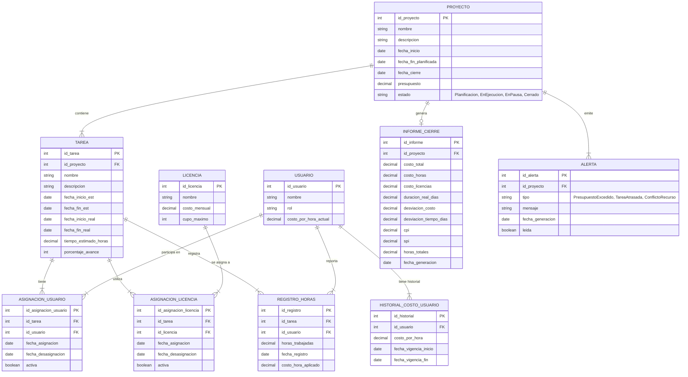
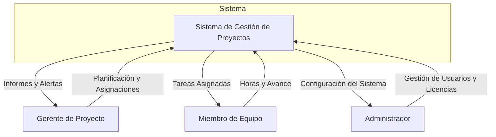
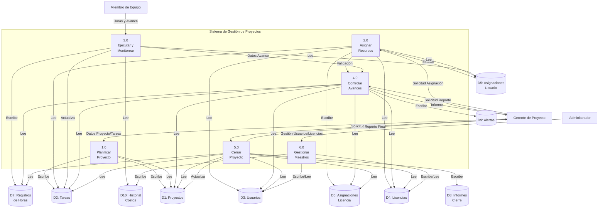
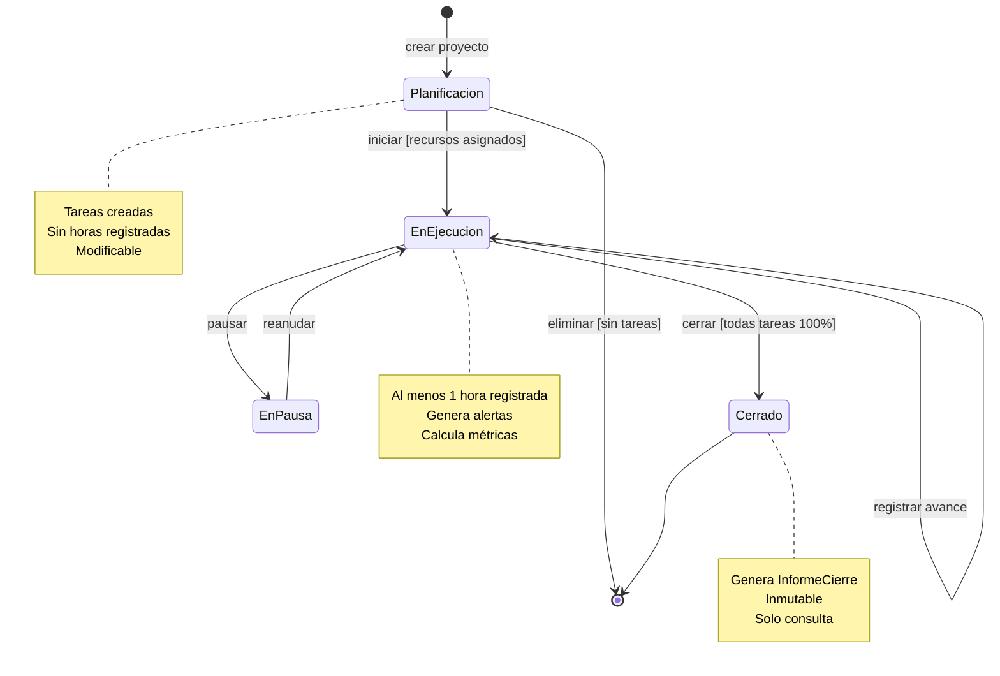
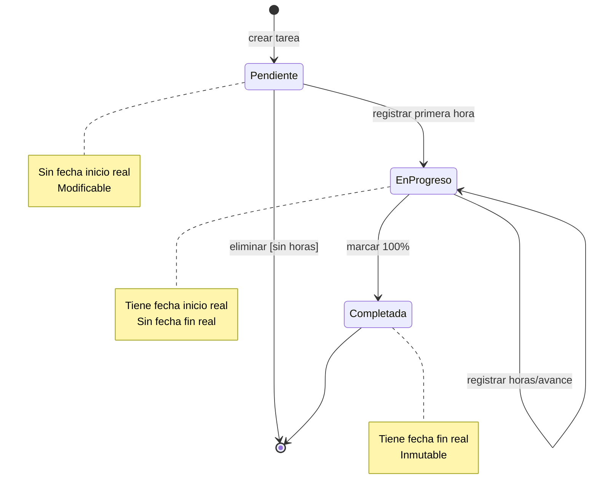
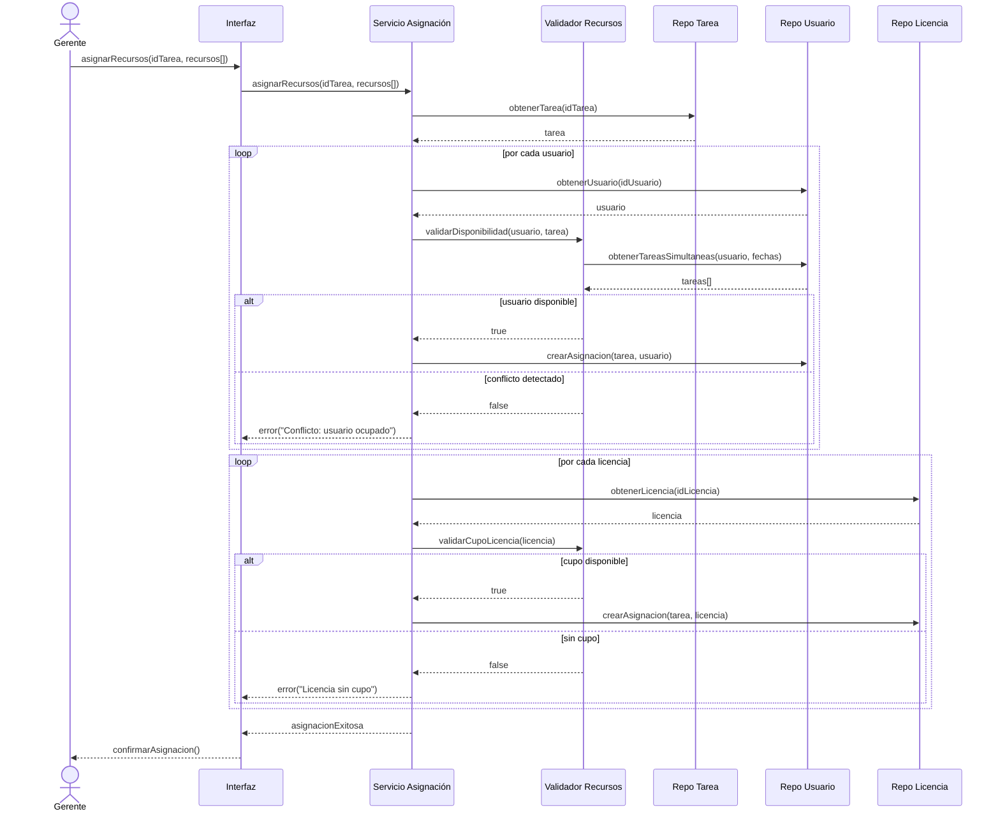
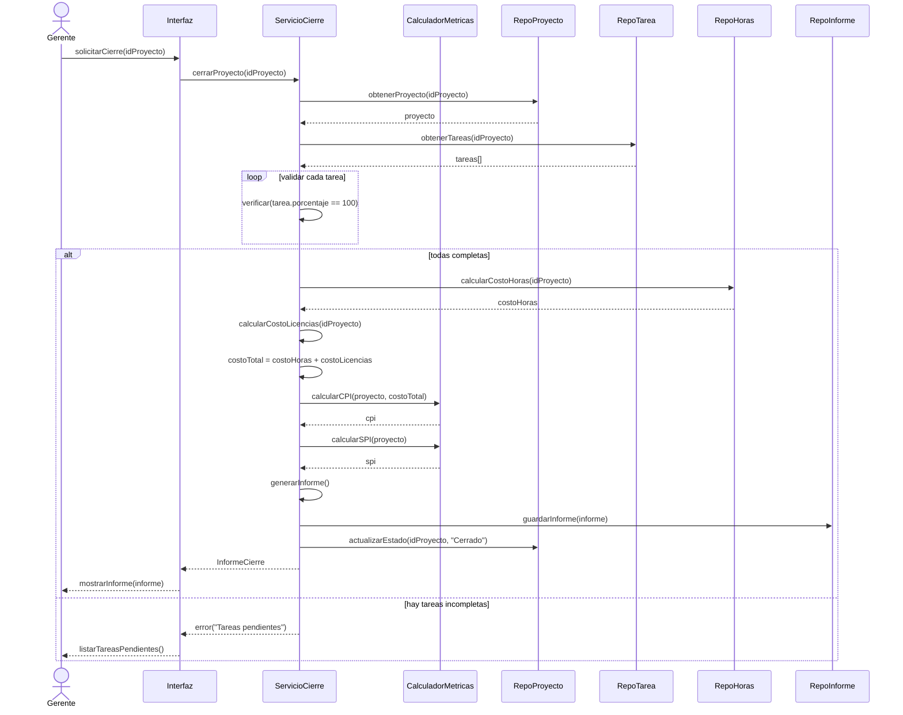

## 1. Objetivos

### Objetivo General

Desarrollar un prototipo de software para la gestión integral del ciclo de vida de proyectos, que permita la planificación, asignación de recursos, ejecución, monitoreo y cierre, proveyendo métricas avanzadas para la evaluación de su desempeño basadas en estándares de gestión de valor ganado.

### Objetivos Específicos

- **Facilitar** la definición y estructuración de proyectos mediante la creación y organización de tareas con validación de dependencias temporales.
- **Permitir** la asignación eficiente de recursos humanos y materiales con verificación de disponibilidad y detección de conflictos.
- **Habilitar** el registro y seguimiento del progreso con captura automática de fechas reales de inicio y finalización.
- **Proveer** mecanismos de control con indicadores de desempeño (CPI, SPI) y alertas tempranas de desviaciones.
- **Automatizar** el cierre de proyectos con generación de informes que incluyan análisis de valor ganado y lecciones aprendidas.
- **Garantizar** la trazabilidad completa de cambios en recursos, costos y cronogramas.

---

## 2. Análisis

### Requerimientos Funcionales (RF)

#### Gestión de Proyectos

- **RF-001:** El sistema debe permitir el registro de nuevos proyectos especificando nombre, descripción, fecha de inicio, fecha de fin planificada y presupuesto.
- **RF-002:** El sistema debe registrar automáticamente la fecha de cierre real al cerrar un proyecto.
- **RF-003:** El sistema debe permitir modificar datos de proyectos en estado "Planificación" únicamente.
- **RF-004:** El sistema debe permitir consultar el historial completo de proyectos cerrados con sus métricas finales.

#### Gestión de Tareas

- **RF-005:** El sistema debe permitir la creación de tareas con descripción, fechas estimadas de inicio y fin, y tiempo estimado en horas.
- **RF-006:** El sistema debe validar que la fecha de fin estimada sea posterior a la fecha de inicio estimada.
- **RF-007:** El sistema debe registrar automáticamente la fecha de inicio real al primer registro de horas en la tarea.
- **RF-008:** El sistema debe registrar la fecha de fin real cuando el porcentaje de avance alcance el 100%.
- **RF-009:** El sistema debe permitir modificar o eliminar tareas que no tengan horas registradas.

#### Gestión de Usuarios y Licencias

- **RF-010:** El sistema debe permitir el registro de usuarios con nombre, rol y costo por hora.
- **RF-011:** El sistema debe permitir modificar el costo por hora de usuarios manteniendo historial de cambios.
- **RF-012:** El sistema debe permitir el registro de licencias de software especificando nombre, costo mensual y cupo máximo de usuarios.
- **RF-013:** El sistema debe validar que las licencias no excedan su cupo máximo al asignarlas.

#### Asignación de Recursos

- **RF-014:** El sistema debe permitir asignar uno o más usuarios a una tarea específica.
- **RF-015:** El sistema debe validar la disponibilidad del usuario antes de asignarlo, detectando conflictos con otras tareas simultáneas.
- **RF-016:** El sistema debe permitir asignar una o más licencias a una tarea validando disponibilidad de cupos.
- **RF-017:** El sistema debe permitir reasignar recursos sin perder el historial de trabajo previo.

#### Ejecución y Monitoreo

- **RF-018:** El sistema debe permitir a los usuarios registrar las horas trabajadas en sus tareas asignadas.
- **RF-019:** El sistema debe validar que la suma de horas diarias por usuario no exceda la jornada laboral (8 horas por defecto, configurable).
- **RF-020:** El sistema debe permitir actualizar el porcentaje de avance de una tarea (0-100%).
- **RF-021:** El sistema debe calcular automáticamente el porcentaje de avance general del proyecto basado en el avance ponderado de sus tareas.

#### Control y Reportes

- **RF-022:** El sistema debe calcular el costo real acumulado incluyendo horas trabajadas y costos de licencias asignadas.
- **RF-023:** El sistema debe calcular el índice de desempeño de costos (CPI = Valor Ganado / Costo Real).
- **RF-024:** El sistema debe calcular el índice de desempeño del cronograma (SPI = Valor Ganado / Valor Planificado).
- **RF-025:** El sistema debe generar alertas cuando el costo real supere el 90% del presupuesto.
- **RF-026:** El sistema debe generar reportes de avance con métricas de desempeño y proyecciones.

#### Cierre y Evaluación

- **RF-027:** El sistema debe permitir cerrar un proyecto únicamente si todas sus tareas están al 100% de avance.
- **RF-028:** El sistema debe generar un informe final que incluya: duración total real, costo total real (horas + licencias), desviaciones de presupuesto y cronograma, CPI, SPI, y horas totales trabajadas.
- **RF-029:** El sistema debe almacenar permanentemente los informes de cierre para consulta histórica.

## DER 

## Data Flow Diagram

## creación de proyecto

## Diagramas de Estado

## Diagrama de Sequencia para cierre de proyecto

